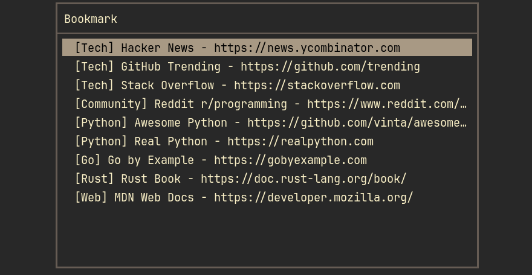

# marks

Minimal ncurses-style bookmark manager (keyboard only).

## Screenshots

<table>
  <tr>
    <td></td>
    <td></td>
  </tr>
  <tr>
    <td></td>
    <td></td>
  </tr>
</table>

## Run

```
python main.py
```

Data is stored at `~/.local/share/marks/bookmarks.json` (override with `MARKS_DATA_FILE` if needed). The file is created automatically on first save.
Config lives at `~/.config/marks/config` (stores accent color).

## Keys

- Up/Down (or j/k): move selection
- g / G: jump to top / bottom (Home/End also work)
- a: add bookmark (folder, title, URL)
- e: edit selected bookmark (title/URL/note)
- m: move selected bookmark (Move to folder)
- d: delete selected bookmark (y/n confirm)
- f: filter by folder (blank to show all)
- o: open selected bookmark in browser
- /: search (full text: folder/title/url/note)
- q: quit (auto-saves to `bookmarks.json`)

### CLI helpers

- Add without TUI: `python main.py -a -n "Title" -u "https://example.com" [-f "Folder"] [--note "Note"]`
- List for launchers: `python main.py -l` (output `[Folder] Title - URL`; add `--include-note` to append `| note`)
- Rofi launcher mode: `python main.py -r` (opens rofi -dmenu with the same format; selects a URL and opens via xdg-open)
- Import from browser export (HTML): `python main.py --import-html /path/to/bookmarks.html` (non-standard folders are kept; otherwise bookmarks go to folder `Import`)

### Install as `marks`

If `~/.local/bin` is on your `PATH`:

```
chmod +x main.py
ln -s /home/ph/code/marks/main.py ~/.local/bin/marks
```

Or copy instead of symlink:

```
install -m 755 main.py ~/.local/bin/marks
```
